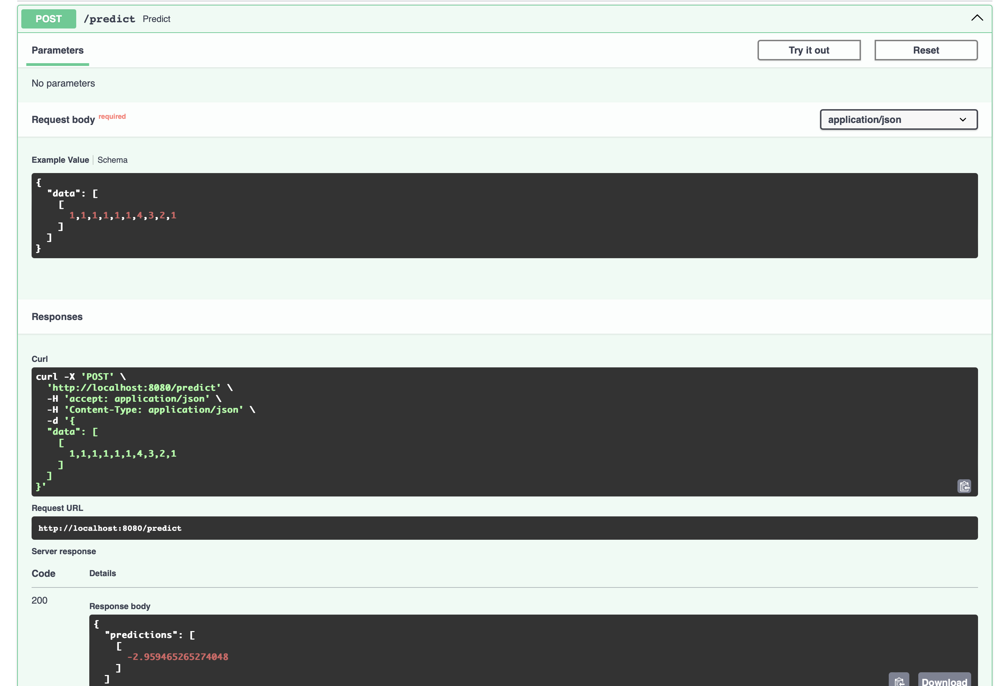

### Scalable model deployment
----------
* Objective: deploy a containerize PyTorch model using KServe on a kubernetes cluster with autocscaling

#### Goal:
---------
Deploy a PyTorch model (packaged in container) to a kubernetes cluster using KServe as the model serving layer, and enable autoscaling as pods scale with traffic or resources metrics.

#### High Level architecture:
[CI/CD: build image + push to registry]
         ↓
[Object Store / PVC] <-- model artifacts
         ↓
[Kubernetes Cluster]
  ├─ KServe (InferenceService CRDs)
  ├─ Ingress / Istio / Knative
  ├─ Metrics (Prometheus)
  └─ Autoscaling (Knative KPA / K8s HPA / KEDA)

#### Steps:
-----------
1. Export/save PyTorch model (TorchScript or simple pickled model).
2. Create minimal model server container (FastAPI + PyTorch load/predict OR use TorchServe).
3. Build & push Docker image to registry.
4. Upload model artifact to storage (S3 / GCS / PVC / MinIO).
5. Install KServe on your Kubernetes cluster (assumes Knative gateway installed).
6. Create a KServe InferenceService that points at your image and model storage.
7. Configure autoscaling (Knative annotations, HPA or KEDA).
8. Test with load / verify autoscaling & logs.
9. Add monitoring & alerts.

* Build and push docker
docker build -t pytorch-server:latest .
docker push pytorch-server:latest

* Note: For production, avoid baking large models into images--instead pull from object store (S3 | MinIO) at startup or KServe/Triton handle model repo.
Upload model.pt to S3/GCS/MinIO or make available on PVC. e.g. on AWS
aws s3 cp model.pt s3://my-model-bucket/models/my-model/1/model.pt


```bash
docker build -t pytorch-server:latest .
docker run -d --name pytorch_server_container -p 8080:8080 pytorch-server:latest
-d runs in detached mode.
--name pytorch_server_container gives it a name for easy logging.
-p 8080:8080 maps host port 8080 → container port 8080.
```

* check logs:
```bash
docker logs -f pytorch_server_container
```


